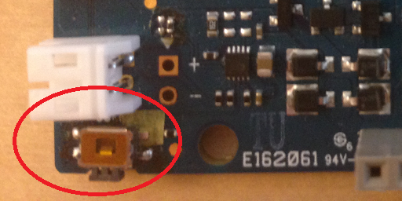
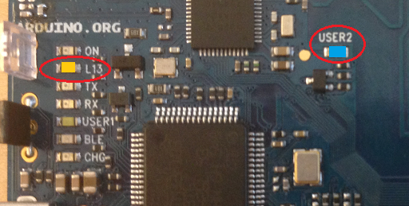
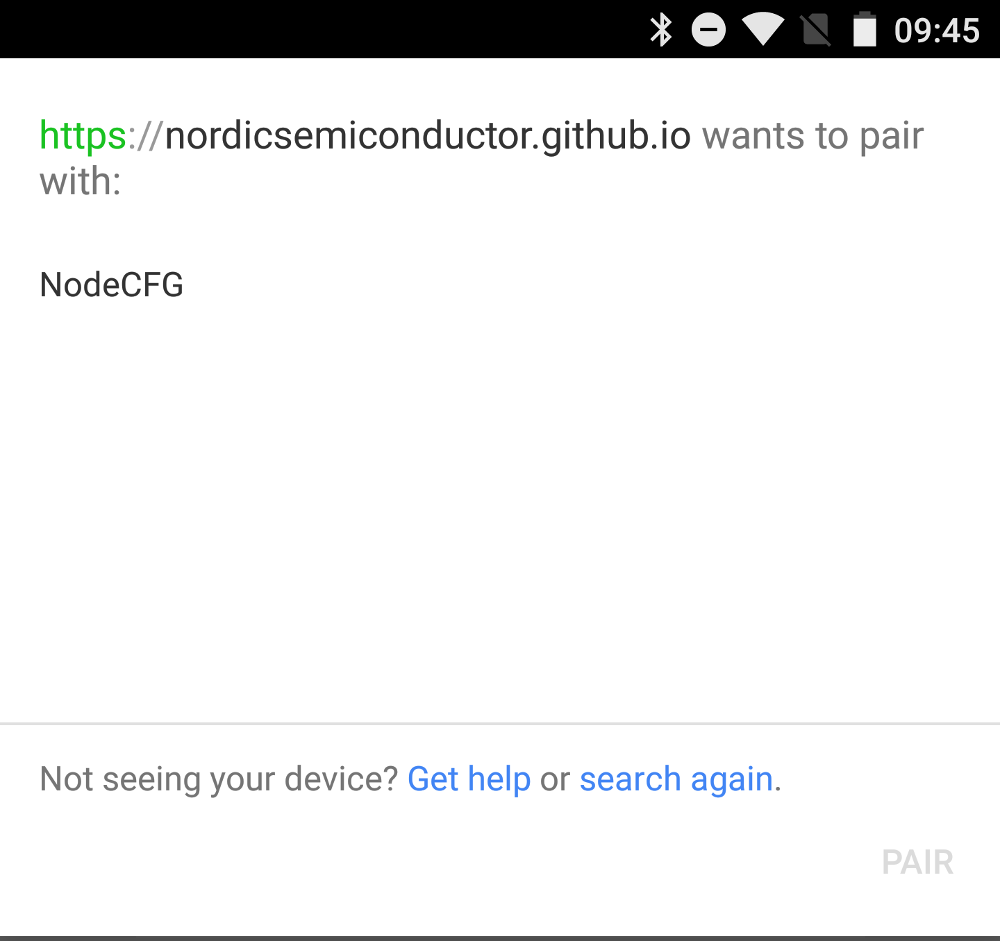
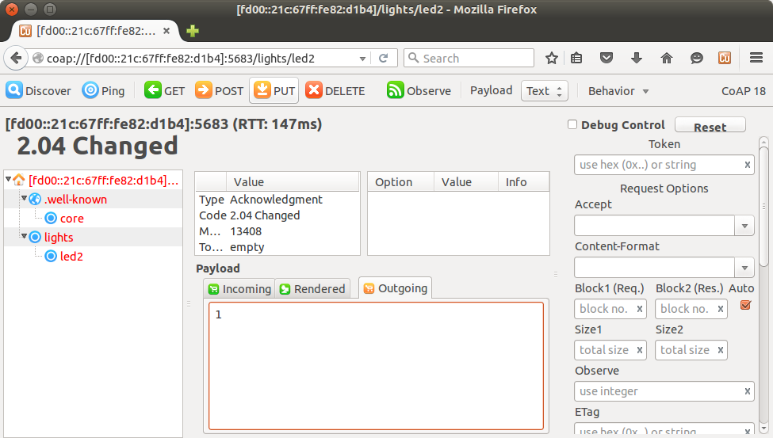
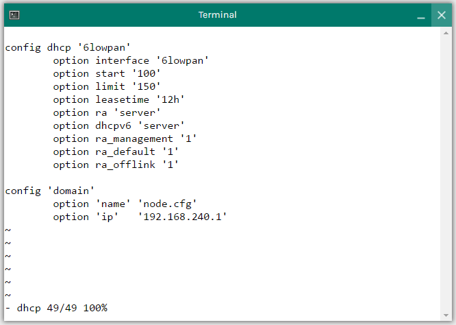
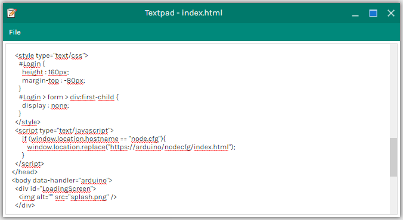

# Simple setup for entering configuration mode via Web Bluetooth for Arduino Primo

This guide describes how to connect a node to a 6LoWPAN router using the Node Configuration application. The Node Configuration application is using Web Bluetooth to connect to your Arduino Primo, where you can define the SSID and the key on the device. If the correct values are defined, the Arduino Primo will connect to the router and get an IPv6 address.
The Arduino Primo is using an Eddystone beacon to broadcast the URL from which the Node Configuration application is available, and it is using the commissioning module of the IoT SDK for device configuration and to be able to join a 6LoWPAN router.

To run the example, you need the following devices:
  * Arduino Primo
  * Arduino TIAN
  * An Android phone running Android OS version 6.0 (Marshmallow) or newer.


## The CoAP server Eddystone example


The Primo is broadcasting both NodeCFG and an Eddystone URL. The phone receives a notification from the Eddystone URL. After accepting the notification, the phone receives a Web Bluetooth application from the cloud on the given URL. 


After the phone has received the Web Bluetooth application and you have pressed the CONNECT button, the phone starts scanning for advertising devices. Select the device with the name “NodeCFG” among the ones that are advertising. When you click the device name in the list, the application will establish a connection to the device via Web Bluetooth.


When the Web Bluetooth connection is established, the phone will be in configuration mode, and you can configure the Primo. First, set the SSID and key to fit the TIAN. After SSID and key have been written on the Primo, the Primo will automatically disconnect from the phone and jump into joining mode, hence start broadcasting “arduinotian” in its advertisement payload. 


The TIAN (6lowpan_daemon) constantly searches for devices that advertise the IPSP service and its own SSID (in this case “arduinotian”). The TIAN will allow the Primo to connect and perform a legacy pairing procedure using the shared key between Primo and TIAN.


After the BLE connection has been established between the Primo and the TIAN, the Primo receives an IPv6 prefix from the TIAN using SLAAC, which completes its global IPv6 address. The Primo can now be reached from the rest of the network. 


## Installing the IoT SDK and the Arduino Primo add-on component examples

1. Download the nrf5_iot_sdk zip file from [here](http://developer.nordicsemi.com/nRF5_IoT_SDK/nRF5_IoT_SDK_v0.9.x/).

2. Unzip the SDK. The target folder chosen when extracting the zip file will from now on be called "\<sdk-root\>".
    
3. Install the flash programming toolchain.
  * If you want to use __JLink__ and __nrfjprog__ to flash, download and install the programming tools:
    1. Navigate to [http://www.nordicsemi.com/eng/Products/Bluetooth-Smart-Bluetooth-low-energy/nRF52832](http://www.nordicsemi.com/eng/Products/Bluetooth-Smart-Bluetooth-low-energy/nRF52832) in a browser and select the “Downloads” tab.
    2. Download the “nRF5x-Command-Line-Tools” for your architecture.
    3. Install the tools.

  * If you want to use __OpenOCD__ to flash, download the OpenOCD application supporting the nRF52 for your OS:
    * [OpenOCD for OSX](http://download.arduino.org/tools/openocd-primo/OpenOCD-0.9.0-arduino.org-apple-darwin13.4.0-nrf52.tar.bz2)
    * [OpenOCD for Linux 32bit](http://download.arduino.org/tools/openocd-primo/OpenOCD-0.9.0-arduino.org-i686-linux-gnu-nrf52.tar.bz2)
    * [OpenOCD for Linux 64bit](http://download.arduino.org/tools/openocd-primo/OpenOCD-0.9.0-arduino.org-x86_64-linux-gnu-nrf52.tar.bz2)
    * [OpenOCD for Windows](http://download.arduino.org/tools/openocd-primo/OpenOCD-0.9.0-arduino.org-win32-nrf52.tar.bz2)

4. Do a git clone of the Arduino Primo SDK add-on:
    * Navigate to __\<sdk-root\>/examples/__ in your extracted SDK and perform a git clone of the add-on by issuing the following command:
    ```
    git clone https://github.com/NordicPlayground/arduino-primo-iot-examples.git arduino_primo 
    ```


## Flashing the CoAP server with Eddystone using a SEGGER J-Link Programmer

1. Connect the SEGGER J-Link Programmer to the 10-pin header close to the nRF52 chip as illustrated by the following image:


   

   
2. Connect the device to a USB power supply.
3. To flash the BLE SoftDevice onto the Arduino Primo board, run the following commands:
    ```
    nrfjprog --eraseall -f nrf52
    nrfjprog --program <sdk-root>\components\softdevice\s1xx_iot\s1xx-iot-prototype3_nrf52_softdevice.hex -f nrf52
    ```
   
4. To flash the CoAP server with Eddystone onto the Arduino Primo board, run the following command:
    ```
    nrfjprog --program <sdk-root>\examples\arduino_primo\coap\ipv6\server_eddystone\hex\nrf52832_xxaa_s1xx_iot.hex -f nrf52
    ```
    
5. To reset the Arduino Primo board, run the following command:
    ```
    nrfjprog --reset -f nrf52
    ```


## Flashing the CoAP server using OpenOCD

If you want to use __OpenOCD__ to flash, download the OpenOCD application supporting the nRF52 for your OS:
    * [OpenOCD for OSX](http://download.arduino.org/tools/openocd-primo/OpenOCD-0.9.0-arduino.org-apple-darwin13.4.0-nrf52.tar.bz2)
    * [OpenOCD for Linux 32bit](http://download.arduino.org/tools/openocd-primo/OpenOCD-0.9.0-arduino.org-i686-linux-gnu-nrf52.tar.bz2)
    * [OpenOCD for Linux 64bit](http://download.arduino.org/tools/openocd-primo/OpenOCD-0.9.0-arduino.org-x86_64-linux-gnu-nrf52.tar.bz2)
    * [OpenOCD for Windows](http://download.arduino.org/tools/openocd-primo/OpenOCD-0.9.0-arduino.org-win32-nrf52.tar.bz2)

1. Connect a USB cable from your OpenOCD enabled PC to the Arduino Primo board as shown in the image below:

   

   
2. To flash the BLE SoftDevice onto the Arduino Primo board, run the following command:
    ```
    <openocd-root-dir>\bin\openocd -s <openocd-root-dir>\share\openocd\scripts -f board\arduino_primo.cfg -c "program <sdk-root>\components\softdevice\s1xx_iot\s1xx-iot-prototype3_nrf52_softdevice.hex verify reset exit"
    ```

3. To flash the CoAP server with Eddystone onto the Arduino Primo board, run the following command:
    ```
    <openocd-root-dir>\bin\openocd -s <openocd-root-dir>\share\openocd\scripts -f board\arduino_primo.cfg -c "program <sdk-root>\examples\arduino_primo\coap\ipv6\server_eddystone\hex\nrf52832_xxaa_s1xx_iot.hex verify reset exit"
    ```
Using the absolute path to the HEX file might cause a problem on MS Windows. As a workaround, copy the HEX file into the same directory as openocd.

4. To reset the Arduino Primo board, first unplug and then plug in the USB cable again.


## Example description

The image flashed to the Arduino Primo is a modified [CoAP server](http://infocenter.nordicsemi.com/topic/com.nordic.infocenter.iotsdk.v0.9.0/iot_sdk_app_coap_server.html) from the IoT SDK v.0.9.0. In addition to advertise the node configuration, the kit will also advertise [Eddystone URLs](https://github.com/google/eddystone) to the Node Configuration Web Bluetooth application. Button 1 is used to clear settings from the Arduino Primo. If Button 1 is pressed on startup, the Arduino Primo will advertise a local address instead of the shortened URL, [https://goo.gl/PaEYF1](https://goo.gl/PaEYF1).

   


The Arduino Primo board has two LEDs, which are showing states. The following LEDs are used by the application:

|   Application LED   |   Arduino Primo LED   |
|---------------------|-----------------------|
|        LED1         |          L13          |
|        LED2         |         USER2         |

The position of the LEDs is shown in the following image:

   


__LED1__ (yellow) shows the connection state of the application. If LED1 on the Arduino Primo board is blinking, it means that the board is advertising. If LED1 is steady-on, it means that the board has a BLE connection.

__LED2__ (blue) is application-specific. If "Identify" mode is issued from the Android application during the configuration, the LED2 will be blinking. In connection, the server example is the only one using LED2 to represent toggle requests from the client application.


## Setting up the Arduino TIAN for the first time

If it’s your first time using the Arduino TIAN, we recommend to take a look at the [getting started with Tian](http://www.arduino.org/learning/getting-started/getting-started-with-arduino-tian).

### Set up a Bluetooth daemon with SSID and key 

1. Open a terminal inside the Arduino OS and specify the following:  
  Login: root  
  Password: arduino
2. Install the Bluetooth daemon.  
    ```
    opkg install bluez-daemon bluez-libs bluez-utils bluez-examples bluez-6lowpan-daemon
    ```
3. The bluetooth\_6lowpan daemon will use the SSID and the key from the wireless settings. Commissioning requires a 6-digit key and an SSID with length between 6 and 16 characters. Our SSID is “arduinotian” and our key “123456”.
    ```
    uci set wireless.@wifi-iface[0].ssid='arduinotian'
    uci set wireless.@wifi-iface[0].key='123456'
    uci commit wireless
    wifi
    ```  


### Add a 6lowpan network interface and link it to the future bt0

1. Open /etc/config/network for editing and add the following sections at the bottom of the file:
    ```    
    config interface '6lowpan'
          option ifname 'bt0'
          option proto 'static'
          option ip6assign '64'
                                   
    config globals 'globals'           
          option ula_prefix 'fd00::/48'

    ```
2. Edit the 'lan' interface by adding the following line to the configuration:
    ```
    option ip6assign '64'
    ```


### Enable prefix distribution on the 6lowpan interface using SLAAC

1. Open /etc/config/dhcp for editing and add the following sections at the bottom of the file:
    ```
    config dhcp 'lan'
          option interface 'lan'
          option start '100'
          option limit '150'
          option leasetime '12h'
          option dhcpv6 'server'
          option ra 'server'
          option ra_management '1'
          option ra_default '1'

    config dhcp '6lowpan'
        option interface '6lowpan'
        option start '100'
        option limit '150'
        option leasetime '12h'
        option ra 'server'
        option dhcpv6 'server'
        option ra_management '1'
        option ra_default '1'
        option ra_offlink '1'
    ```


### Edit the firewall to forward the IPv6 packages from wlan0 to bt0

1. Open /etc/config/firewall for editing and replace its content with the following content:
    ```
    config defaults
        option syn_flood '1'
        option input 'ACCEPT'
        option output 'ACCEPT'
        option forward 'ACCEPT'

    config zone
        option name 'lan'
        option network 'lan'
        option input 'ACCEPT'
        option output 'ACCEPT'
        option forward 'ACCEPT'

    config zone
        option name 'wan'
        option network 'wan'
        option input 'ACCEPT'
        option output 'ACCEPT'
        option forward 'REJECT'

    config zone
        option input 'ACCEPT'
        option forward 'ACCEPT'
        option output 'ACCEPT'
        option name 'bt_ipv6'
        option network '6lowpan'

    config forwarding
        option dest 'lan'
        option src 'bt_ipv6'

    config forwarding
        option dest 'wan'
        option src 'bt_ipv6'

    config forwarding
        option dest 'bt_ipv6'
        option src 'lan'
    ```


### Change Bluetooth 6LoWPAN daemon from whitelist to authentication mode

1. Open /etc/init.d/bluetooth_6lowpand for editing and replace the invoker line:  
    `$PROG -w 3 -t 5 -W -d`  
    To  
    `$PROG -w 3 -t 5 -a -d`


### Reboot the system

1. Reboot the system by executing the following command:  
    ```
    reboot
    ```

The Arduino TIAN is now ready and looking for devices advertising the correct SSID.


## Setting up the Web Bluetooth and Physical Web on Android

The Node Configuration application uses Web Bluetooth. To be able to use Web Bluetooth, you must have Android OS version 6.0 (Marshmallow) or newer. Android Lollipop is not compatible with latest version of Web Bluetooth.
Chrome is currently the only browser compatible with Web Bluetooth, so Chrome must be installed. To enable Web Bluetooth in Chrome, go to chrome://flags and enable Web Bluetooth.  
Enable Bluetooth on your phone and make sure you have an internet connection.

If you want the Arduino Primo to notify your phone with a URL via Eddystone, you must also enable the Physical Web in Chrome under Settings - Privacy, and enable location in Android.

## Opening the Node Configuration application

Now that the phone is set up and the Arduino Primo is running, open the application and start establishing a connection to the Arduino Primo. You can choose if you want to use the Eddystone URL or not.


### Without Eddystone

Open Chrome in Android and go to https://goo.gl/PaEYF1. 
You will now reach the Node Configuration application.


### Via Eddystone

If your Arduino Primo sends out Eddystone URLs, just wait for a notification on your phone, accept it, and open the link in Chrome. You will now reach the Node Configuration application.

If you don't receive a notification, make sure all your settings in Android and Chrome are correct.


## The Node Configuration application

   


To connect to the Arduino Primo, press the CONNECT button.

   


A pop-up window will appear, with all devices the Web Bluetooth can find that have the correct service UUID. You must choose your device (NodeCFG). 

   


If the connection is successful, you will reach the configuration mode and LED1 on the Arduino Primo will be switched on. If you want to make sure that you are connected to the correct device, press the IDENTIFY button. The connected device will enter identify mode and LED2 will blink for 10 seconds before returning to configuration mode.  
You can change the settings and send the changes to the Arduino Primo by pressing the SUBMIT button.  
The SSID should be set to “arduinotian” and the key field to “123456”.
The delay field is used to define when, after submitting, the device should enter the joining mode. The delay is measured in seconds.
The duration field is used to define how many seconds the device will stay in the joining mode.
In the state-on-failure field, you define what the device should do if the connection is not established after the duration time is exceeded. 

If all values are set correctly, the Arduino Primo will enter joining mode and advertise its SSID. LED1 will be blinking. The Arduino Primo is then discovered by the Arduino TIAN. The Arduino Primo and TIAN will exchange the keys and connect. If the connection is successfully established, LED2 on the Arduino Primo will be switched on. Your Arduino Primo now has its own IPv6 address.

The application will disconnect after submitting, but you can reconnect if the node is in connectable mode.
The log will always keep you updated and give you messages about success, warnings, and errors related to the configuration.
To see the source code on Github, press the Github logo, and to see the source code for the Primo, press the Nordic Semiconductor logo.


## Finding the IPv6 address of the device

The device has a hardcoded MAC address. This makes it easier to access the device without any need to use the TIAN for finding the MAC address. However, the MAC address must still be converted into an IPv6 address. There are many converters available online, for example, [simple converter](http://ben.akrin.com/?p=1347). The prefix should be FD00, not FB80.

The hardcoded MAC address is: `00:1C:67:82:D1:B4`.   
This gives the following IPv6 address: `FD00::21C:67FF:FE82:D1B4`.

You can now use the IPv6 address to communicate with the Arduino Primo. Next, verify that the device is actually connected through IPv6 by toggling some lights. 

## Verifying the IPv6 connection
You need a PC with Ubuntu installed to verify that the kit is connected via IPv6.
1. Connect to the “arduinotian” Wi-Fi (the kit has only a local IPv6 address).
2. Open Firefox.
3. Install the [Copper (Cu)](https://addons.mozilla.org/en-US/firefox/addon/copper-270430/) add-on for Firefox.
4. Open the CoAP server in Firefox:
```
    coap://[fd00::21c:67ff:fe82:d1b4]/
```
5. Click the ‘Discover’ button in the upper left-hand corner.
6. Select led2 in the left pane. The Outgoing pane under Payload will be selected.
7. Write “1” into the Outgoing textbox and click the PUT button located in the upper toolbar. This will enable LED 2 on the kit. You can turn the LED off again by writing “0” in Outgoing and then clicking PUT.



You can now be sure that your device has an IPv6 connection! =)


# ADDITIONAL: Hosting the Web Bluetooth on the Arduino TIAN

To host the Web Bluetooth application from the Arduino TIAN, instead of Github, some additional setup on the Arduino TIAN is needed.


## Advanced setup notes 


When the Web Bluetooth application is stored locally on the Arduino TIAN, the setup is similar to the example above, except for the following:
  * The Arduino Primo will advertise a different Eddystone URL hosted locally on the Arduino TIAN’s HTTP server.
  * The Android phone needs to be connected to the Arduino TIAN’s Wi-Fi and request the Web Bluetooth application from the Arduino TIAN.
  * In configuration mode, the SSID and the key will be set by default. This is done by the Web Bluetooth application when running on local network. The Web Bluetooth page will request the SSID and the key from the router by issuing a request to a CGI script hosted on the Arduino TIAN.


## Additional setup of the Arduino TIAN:

The setup from the example above needs to be completed first.
In addition, you need to:
  * Store the Web Bluetooth application files on the Arduino TIAN.
  * Create a custom domain name resolution of the application URL.
  * Add a lua-script file to be able to read internal SSID and key.


Arduino TIAN has uhttpd installed by default. The uhttpd is configured to use /osjs/dist as the source folder for its content. You can verify this by checking the -h flag of uhttpd: 
    ```
    ps | grep "[u]httpd"
    ```
This is where your files need to be stored to easily be accessed.
1. Open File Manager in Arduino OS.
2. Go to /osjs/dist
3. Create a folder __nodecfg__ and upload all the Web Bluetooth application files into the folder. One option to retrieve the files is to install GIT on the Arduino TIAN, clone the [physical-web repository](https://github.com/NordicPlayground/nrf5-physical-web), and copy the content of __projects/ble-6lowpan-joiner__ into this folder. Alternatively, you can download the files in any other way. Make sure that the files from the __projects/ble-6lowpan-joiner__ folder, copied from the repository, are located inside the __nodecfg__ folder.

The files can now be reached using the URL https://arduino/conf/index.html. But the Eddystone has a limited length on its URLs, so a custom URL must be added.


### Adding a custom URL

By adding a custom URL, we can type https://node.cfg and be redirected to the URL https://arduino/nodecfg/index.html (arduino is already a domain name for the global IP).
Use the terminal to open /etc/config/dhcp for editing and add the following at the end:
    ```
    config ‘domain’
        option ‘name’ ‘node.cfg’
        option ‘ip’   ‘192.168.240.1’
    ```




The option ip is the global IP. The name option with the value node.cfg is the shortened URL we want to use. 
For more on how to navigate in files using the terminal, see [this page](https://wiki.openwrt.org/doc/howto/user.beginner.cli).

In /osjs/dist/index.html, add this javascript to the header:

    ```
    <script type="text/javascript">  
        if (window.location.hostname == "node.cfg"){  
            window.location.replace("https://arduino/conf/index.html");  
        }  
    </script>
    ```




The Arduino TIAN will now redirect to the Web Bluetooth application.  
You can edit this file by opening it in a text editor through the file manager.


### Reading the SSID and the key

When storing the javascript and the HTML locally on the Arduino TIAN, the current SSID and the key can be read and used as the default option in the opened configuration page. To do this, create a new file in __/osjs/dist/cgi-bin__. Call the file “get_ssid_and_key”, and do not assign a file-suffix. Paste the following lua-script into the file:

```
#!/usr/bin/lua
local json = require "luci.json"
local wsapi = require "wsapi"
local cgi = require "wsapi.cgi"
local wrequest = require "wsapi.request"
local wresponse = require "wsapi.response"
local osjs = require "osjs"


local function console(cmd, back)
  if back then
    os.execute(cmd .. " &")
    return ""
  end

  local handle = io.popen(cmd)
  local result = handle:read("*a")
  handle:close()
  return result:gsub('%W','')
end

-- ----------------------------------------------------------------------------
--                                     MAIN
-- ----------------------------------------------------------------------------

function run(wsapi_env)

  local len = tonumber(wsapi_env.CONTENT_LENGTH) or 0
  local input = wsapi_env.input:read(len) or ""
  local idata = json.decode(input) or {}

  local request  = wrequest.new(wsapi_env)
  local response = wresponse.new()
  local method = wsapi_env.PATH_INFO:match("^/(%a+)")

  response:content_type("application/json")
  
  local data = {
    ssid  = console("uci get wireless.@wifi-iface[0].ssid"),
    key  = string.sub(console("uci get wireless.@wifi-iface[0].key"),1,6)
  } 
  local error  = false
  local result = {error = error, result = data}
  response:write(json.encode(result))
  return response:finish()
end

cgi.run(run)
```

To allow the file “get_ssid_and_key” to be executed, change the file permissions with the following command:
    ```
    chmod +x /osjs/dist/cgi-bin/get_ssid_and_key
    ```

The Web Bluetooth application javascript checks if it’s located on “arduino” and will then use the “get_ssid_and_key” file to get the local SSID and the key. These values will be used as default suggestions in the node configuration page.

The Arduino TIAN uses self-signed SSL certificates, so Chrome might display a warning about that.


